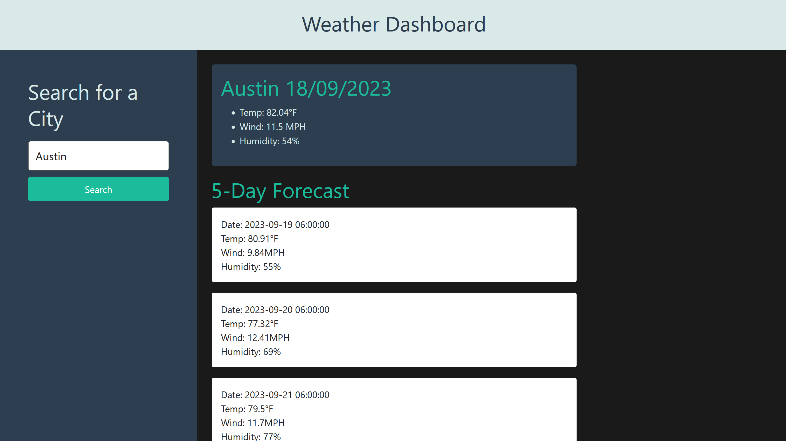

# Weather Dashboard

## Description
This code is used to create a weather dashboard with form inputs that allow the user to search for a city and recieve the present and future weather conditions for that city.

## Website Link
https://nataniel-c.github.io/weather-dashboard

## Website Screenshots

---
